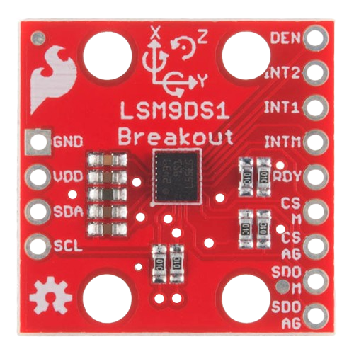
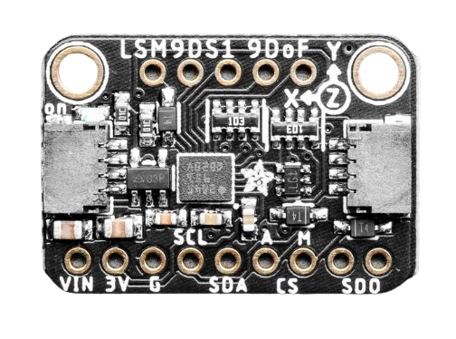
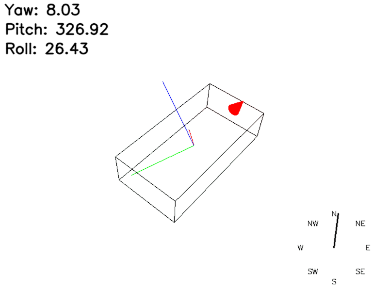

# LSM9DS1-python-library
This is a Python library that attempts to interface with the LSM9DS1 sensor. Sparkfun's original [Arduino library](https://github.com/sparkfun/SparkFun_LSM9DS1_Arduino_Library) was used as the basis for this project.

## 💻 Materials
The SEN-13284 from SparkFun was used to test this library, but it should work with other boards, such as the Adafruit 9-DOF Breakout Board based on the LSM9DS1 chip. It could be purchased at [Mouser](https://www.mouser.es/ProductDetail/Adafruit/4634?qs=W%2FMpXkg%252BdQ6zSzbuDAor%2FQ%3D%3D).

    
    

## 🔧 Dependencies and Installation 
* Python == 3.9.2
* pigpio == 1.78.0
* numpy == 2.0.1
* pygame == 2.6.0
* PyOpenGL == 3.1.7

## 🚀 Code
The project was tested in a Raspberry Pi 4, using the I2C communication protocol.

In the code folder, you can find the necessary code to run the test script called "test_imu.py". Note that the required variables are imported from another file called "IMU_regs.py".

A visual representation of the IMU motion has also been implemented using the pygame and PyOpenGL libraries. Consider that all code needed for this implementation is inside "utils.py"

     

## 📜 License
This project is released under the MIT 2.0 license.

## 📧 Contact
If you have any questions, please email antoniogalvanhernandez1998@gmail.com.

